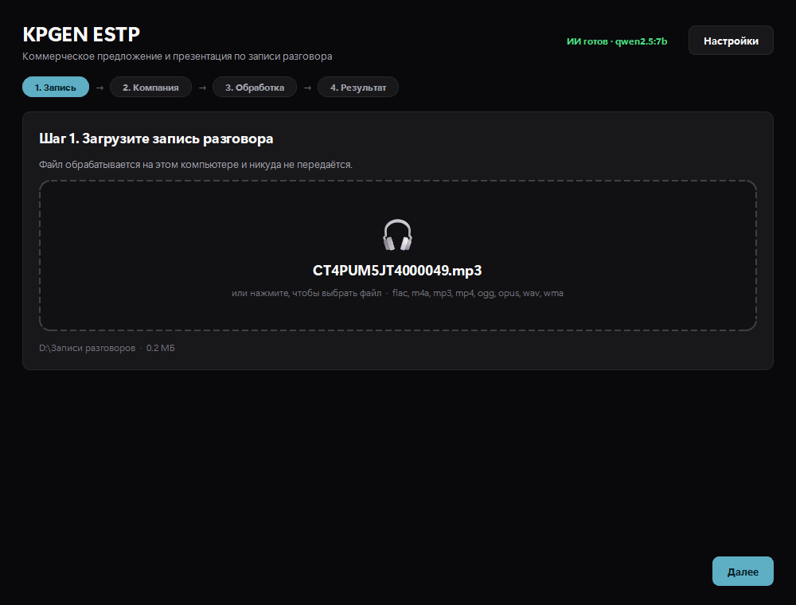
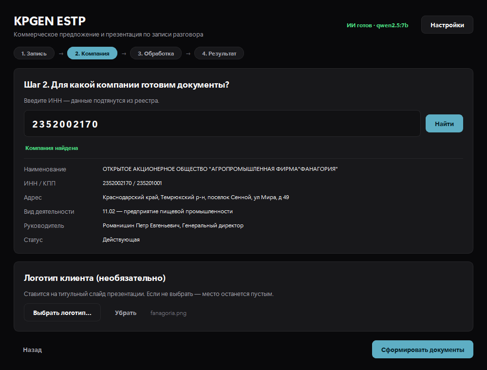
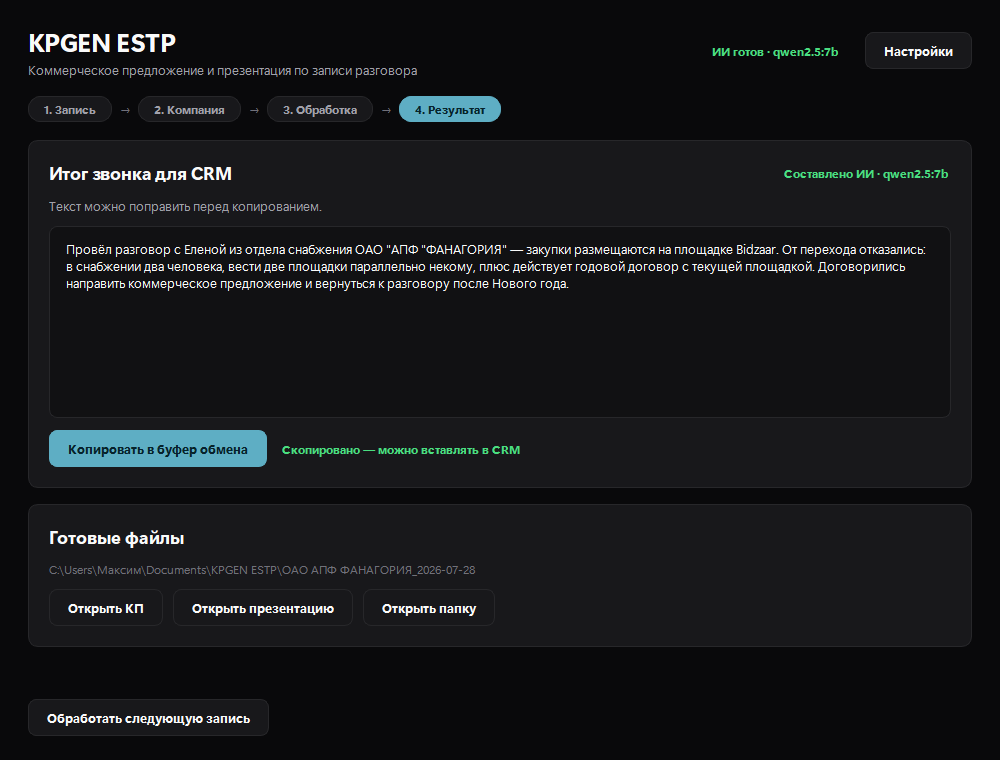
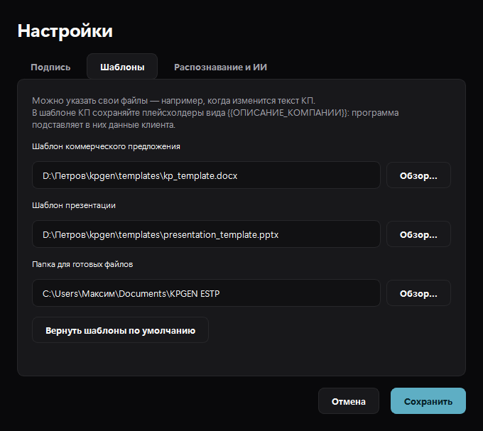

# KPGEN ESTP

Программа готовит коммерческое предложение, презентацию и выжимку разговора
для CRM по аудиозаписи звонка.

Распознавание речи и разбор разговора выполняются на компьютере пользователя.
В интернет уходит только запрос сведений о компании по ИНН.



## Как работает

1. Загружаете запись разговора (mp3, wav, m4a, ogg и др.).
2. Вводите ИНН компании — данные подтягиваются из реестра через DaData.
3. При желании выбираете логотип клиента для титульного слайда.
4. Программа распознаёт речь, разбирает разговор и собирает документы.
5. Выжимку из трёх предложений копируете в CRM одной кнопкой.

### Как это выглядит

Компания подтягивается из реестра по ИНН — проверяете и подтверждаете:



Готовый результат: выжимка для CRM с кнопкой копирования и ссылки на файлы:



Настройки: подпись менеджера, свои шаблоны, модели распознавания и ИИ:



## Установка на рабочий компьютер

Запустите `KPGEN_ESTP_Setup.exe` и следуйте мастеру. Установщик:

- ставит программу в «Program Files»;
- создаёт ярлыки в меню «Пуск» и (по желанию) на рабочем столе;
- добавляет программу в список установленных для корректного удаления.

Требуются права администратора.

При первом запуске Windows может показать окно SmartScreen — программа не
подписана сертификатом разработчика. Нажмите «Подробнее» → «Выполнить
в любом случае»; повторно окно не появится.

### Включение ИИ (по желанию)

Без ИИ программа работает сразу, но тексты получаются более шаблонными.
Чтобы включить умный режим, нужна [Ollama](https://ollama.com):

1. скачайте и установите Ollama с сайта `ollama.com`;
2. выполните в командной строке:

```bash
ollama pull qwen2.5:7b
```

Модель занимает около 4,7 ГБ и скачивается один раз. Программа сама
определит, что Ollama появилась — в правом верхнем углу загорится
«ИИ готов».

### Первый разбор записи

При первой обработке скачается модель распознавания речи (~1,5 ГБ).
Нужен интернет, дальше программа работает автономно.

## Запуск из исходников

Двойной клик по `Запустить KPGEN.bat` либо:

```bash
py app/main.py
```

Зависимости:

```bash
py -m pip install PySide6 python-docx python-pptx faster-whisper
```

Если Ollama не запущена, программа продолжит работать: тексты будут
составлены по правилам — более шаблонные, но пригодные к правке.

## Пересборка дистрибутива

```bash
py -m PyInstaller --noconfirm --clean KPGEN.spec
```

Затем скомпилировать `installer/KPGEN.iss` в Inno Setup — готовый
`KPGEN_ESTP_Setup.exe` появится в папке `dist_installer`.

## Шаблоны

Лежат в папке `templates`:

| Файл | Назначение |
|---|---|
| `kp_template.docx` | Коммерческое предложение с фирменным бланком |
| `presentation_template.pptx` | Презентация ЕСТП, титульный слайд подставляется |

Свои файлы можно указать в настройках. В шаблоне КП должны остаться
плейсхолдеры — в них подставляются данные:

| Плейсхолдер | Что подставляется |
|---|---|
| `{{ОПИСАНИЕ_КОМПАНИИ}}` | сфера деятельности и регион по данным реестра |
| `{{КОНТЕКСТ_РАЗГОВОРА}}` | что клиент обозначил в разговоре |
| `{{ИТОГ_РАЗГОВОРА}}` | договорённости и сроки |
| `{{КОМПАНИЯ_КРАТКО}}` | краткое наименование клиента |
| `{{ИНН}}`, `{{КПП}}` | реквизиты клиента |
| `{{МЕНЕДЖЕР_ФИО}}` и др. | подпись из настроек |

Чтобы пересобрать шаблоны из исходных файлов менеджера:

```bash
py tools/make_templates.py
```

## Где сохраняются результаты

`Документы\KPGEN ESTP\<Компания>_<дата>\`:

- `Коммерческое предложение.docx`
- `Презентация.pptx`
- `Выжимка разговора.txt`
- `Расшифровка разговора.txt`

## Настройки

Хранятся в `%APPDATA%\KPGEN ESTP\settings.json`. Через окно настроек
меняются подпись менеджера, пути к шаблонам, папка результатов,
модели распознавания и ИИ, ключ DaData.

## Проверка конвейера без интерфейса

```bash
py tools/test_pipeline.py
```
